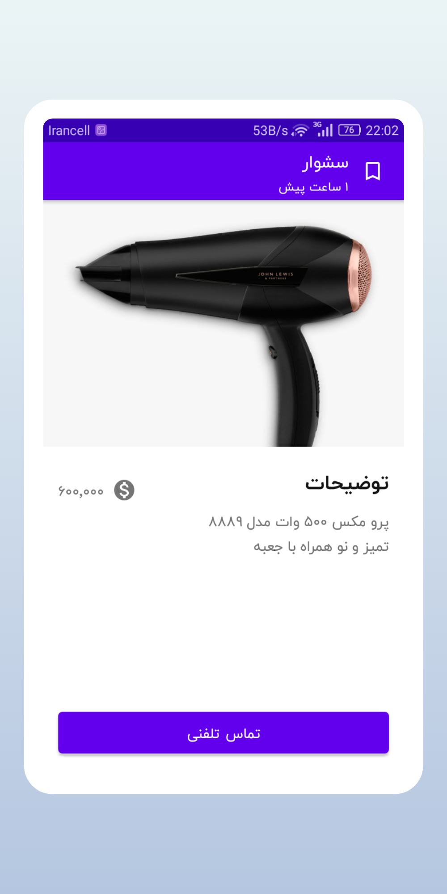
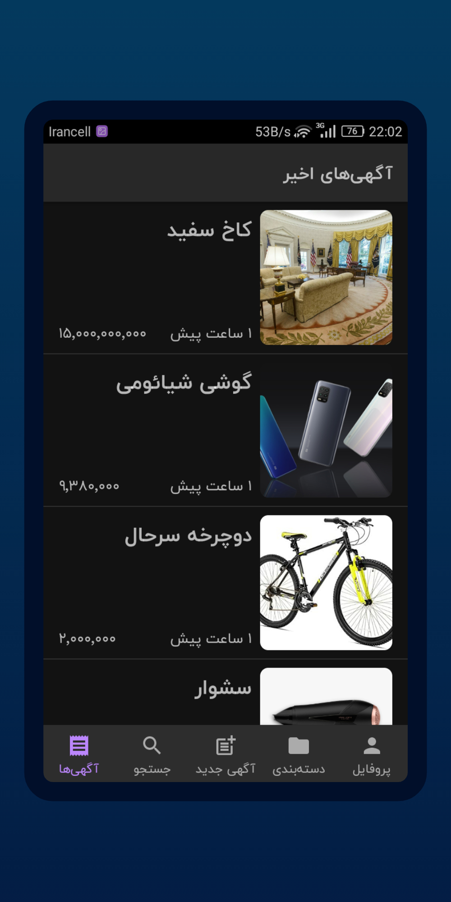
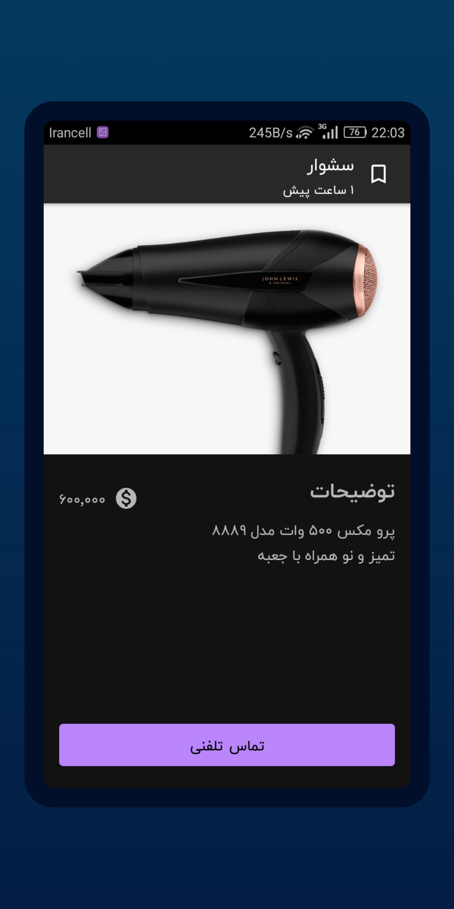

## Sorna
An app that allows users to buy from and sell to with others locally
## Summary
Using Sorna, users can post sale ad of their own second
  hand goods like phones, televisions, carpets or
  everything people can buy from a shop but here
  everything that users are dealing is second hand and
  they must deal together locally out of the app.

| | | | |
|:-------------------------:|:-------------------------:|:-------------------------:|:-------------------------:|
| |  | |  |
| | |  | 

## Tech stack & Open-source libraries
- Minimum SDK level 21
- [Kotlin](https://kotlinlang.org/) based, [Coroutines](https://github.com/Kotlin/kotlinx.coroutines) + [Flow](https://kotlin.github.io/kotlinx.coroutines/kotlinx-coroutines-core/kotlinx.coroutines.flow/) for asynchronous.
- Hilt (alpha) for dependency injection.
- JetPack
  - LiveData - notify domain layer data to views.
  - Lifecycle - dispose of observing data when lifecycle state changes.
  - ViewModel - UI related data holder, lifecycle aware.
  - Room Persistence - construct a database using the abstract layer.
- Architecture
  - MVVM Architecture (View - DataBinding - ViewModel - Model)
  - Repository pattern
- [Retrofit2 & OkHttp3](https://github.com/square/retrofit) - construct the REST APIs and paging network data.
- [GSON](https://github.com/google/gson/) - A modern JSON library for Kotlin and Java.
- [Glide](https://github.com/bumptech/glide), [GlidePalette](https://github.com/florent37/GlidePalette) - loading images.
- [Bundler](https://github.com/skydoves/bundler) - Android Intent & Bundle extensions that insert and retrieve values elegantly.
- [Material-Components](https://github.com/material-components/material-components-android) - Material design components like ripple animation, cardView.

## Architecture
Sorna is based on MVVM architecture and a repository pattern.

